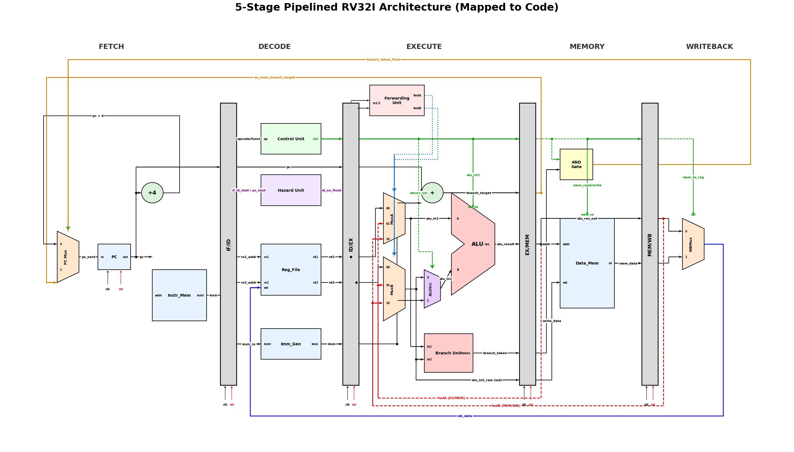
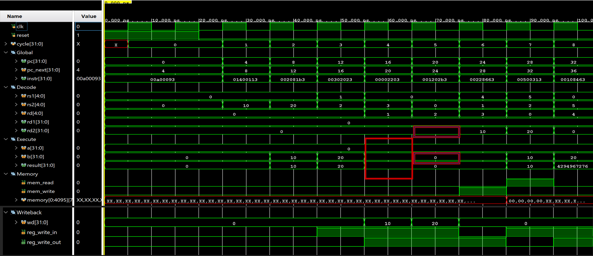
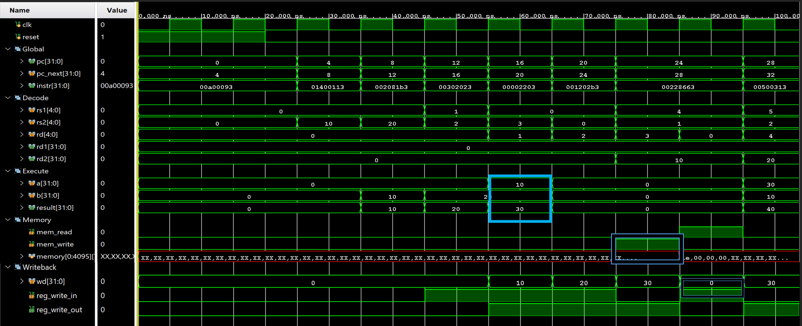
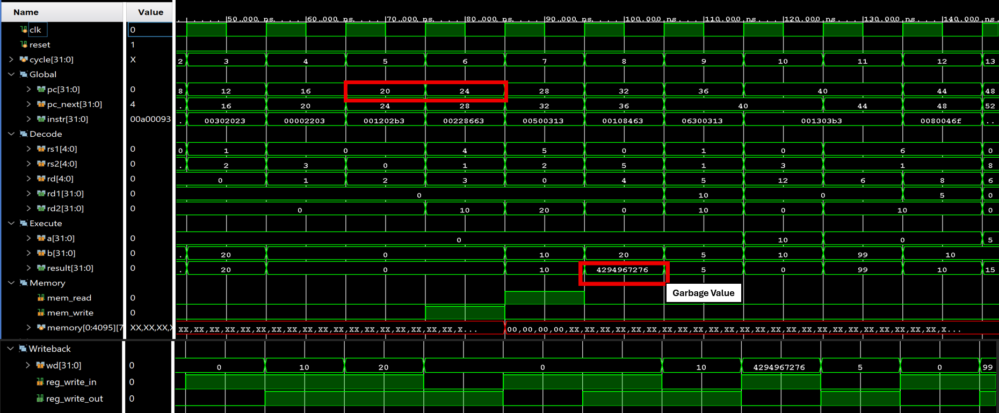
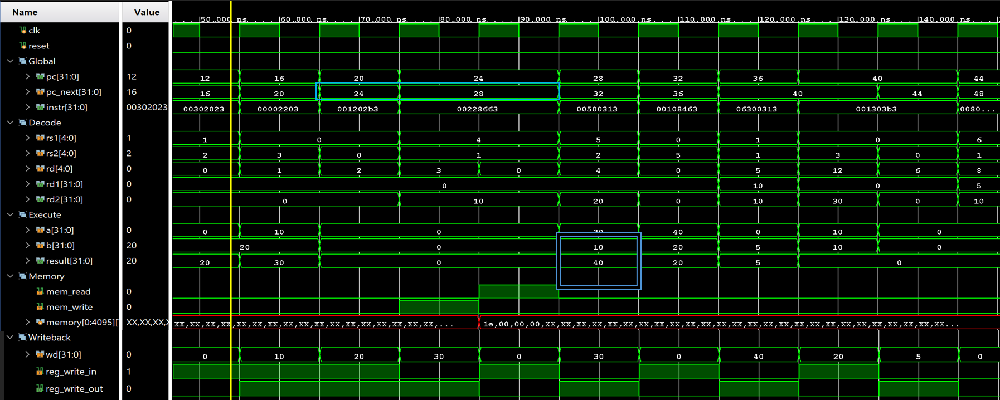
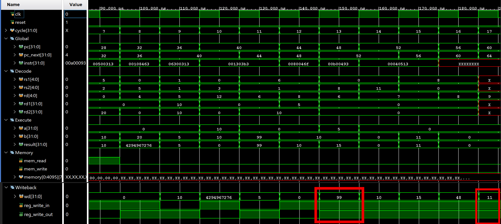
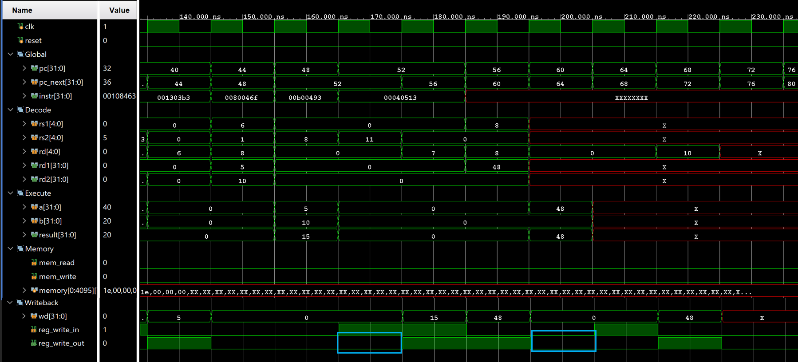

# 5-Stage Pipelined RISC-V Processor (RV32I)

## 📌 Project Overview
This repository contains a high-performance **5-stage pipelined RISC-V processor** (RV32I) designed to handle Data, Control, and Load-Use hazards in hardware. By integrating a sophisticated **Forwarding Unit** and **Hazard Detection Unit**, this processor achieves an ideal CPI of ~1 for sequential code.

---

## 🏗️ Detailed Processor Architecture

Below is the complete datapath logic. This design integrates 14 critical units to ensure timing-accurate execution.

### High-Fidelity Pipeline Schematic

  

### The 14 Core Units
1.  **Program Counter (PC):** Holds the address of the next instruction.
2.  **Instruction Memory (IM):** Stores the 32-bit RV32I machine code.
3.  **Control Unit (CU):** Decodes opcodes and generates signals (RegWrite, ALUSrc, etc.).
4.  **Hazard Detection Unit:** Monitors Load-Use hazards and stalls the pipeline by freezing the PC/IFID.
5.  **Register File:** Dual-read, single-write 32x32-bit register storage.
6.  **Immediate Generator:** Extracts and sign-extends constants from I, S, B, U, and J instructions.
7.  **ALU Control:** Translates `funct3` and `funct7` bits into specific ALU operations.
8.  **ALU (Arithmetic Logic Unit):** Performs arithmetic (ADD, SUB) and logical (AND, OR) operations.
9.  **Data Memory:** Stores program data; accessed during `lw` and `sw` operations.
10. **Forwarding Unit:** Prevents RAW hazards by routing results from EX/MEM or MEM/WB back to ALU inputs.
11. **IF/ID Register:** Holds the instruction and PC for the Decode stage.
12. **ID/EX Register:** Passes decoded values and control signals to the Execute stage.
13. **EX/MEM Register:** Passes ALU results and Store-data to the Memory stage.
14. **MEM/WB Register:** Passes Memory/ALU results back to the Writeback stage.

---

## 🛡️ Hazard Resolution Logic

### 1. Data Hazards (Forwarding)
The **Forwarding Unit** reroutes results directly to the ALU inputs, eliminating the need for stalls in most Register-Register instructions.

### 2. Load-Use Hazards (Stalling)
When an instruction reads a register being loaded by `lw`, the hardware inserts a "bubble" (NOP) to allow the memory read to complete.

### 3. Control Hazards (Flushing)
For **JAL/JALR** and taken **Branches**, the hardware flushes the `IF/ID` register to prevent the execution of instructions in the delay slot.

---

## ⚙️ Supported RV32I Instruction Set

### R-Type Instructions
| Instruction | funct7 | funct3 | Opcode | Operation |
|:---|:---|:---|:---|:---|
| `add` | `0000000` | `000` | `0110011` | `rd = rs1 + rs2` |
| `sub` | `0100000` | `000` | `0110011` | `rd = rs1 - rs2` |
| `and` | `0000000` | `111` | `0110011` | `rd = rs1 & rs2` |
| `or`  | `0000000` | `110` | `0110011` | `rd = rs1 \| rs2` |
| `slt` | `0000000` | `010` | `0110011` | `rd = (rs1 < rs2)` |

### I-Type Instructions
| Instruction | funct3 | Opcode | Operation |
|:---|:---|:---|:---|
| `addi` | `000` | `0010011` | `rd = rs1 + imm` |
| `andi` | `111` | `0010011` | `rd = rs1 & imm` |
| `ori`  | `110` | `0010011` | `rd = rs1 \| imm` |
| `lw`   | `010` | `0000011` | `rd = Mem[rs1 + imm]` |
| `jalr` | `000` | `1100111` | `rd = PC + 4; PC = rs1 + imm` |

### S, B, & J-Type Instructions
| Instruction | Type | Opcode | Operation |
|:---|:---|:---|:---|
| `sw`   | S | `0100011` | `Mem[rs1 + imm] = rs2` |
| `beq`  | B | `1100011` | `if (rs1 == rs2) branch` |
| `bne`  | B | `1100011` | `if (rs1 != rs2) branch` |
| `jal`  | J | `1101111` | `rd = PC + 4; PC = PC + imm` |

---

## 🚀 Simulation & Verification

1.  Clone the repository and add the `.v` source files to your Vivado project.
2.  Load the `test.hex` file into your instruction memory.
3.  Run the testbench `tb_rv32i_pipeline.v`.

**Hex Program Snippet:**

| Hex Instruction | Assembly Instruction | Description           |
|-----------------|----------------------|-----------------------|
| 00A00093        | addi x1, x0, 10      | x1 = 10               |
| 01400113        | addi x2, x0, 20      | x2 = 20               |
| 002081B3        | add x3, x1, x2       | x3 = x1 + x2          |
| 00302023        | sw x3, 0(x0)         | Store x3 to memory[0] |
| 00002203        | lw x4, 0(x0)         | Load memory[0] to x4  |
| 001202B3        | add x5, x4, x1       | x5 = x4 + x1          |
| 00228663        | beq x5, x2, 12       | Branch if x5 == x2    |
| 00500313        | addi x6, x0, 5       | x6 = 5                |
| 00108463        | beq x1, x1, 8        | Branch always         |
| 06300313        | addi x6, x0, 99      | x6 = 99               |
| 001303B3        | add x7, x6, x1       | x7 = x6 + x1          |
| 0080046F        | jal x8, 8            | Jump and link         |
| 00B00493        | addi x9, x0, 11      | x9 = 11               |
| 00040513        | addi x10, x8, 0      | x10 = x8              |

---

## 📊 Performance Verification: Hazard vs. No Hazard Comparison

To verify the robustness of the **Hazard Detection** and **Forwarding** units, the processor was simulated in two states: 
1. **Disabled Hazard Unit:** Resulting in data corruption and incorrect execution.
2. **Enabled Hazard Unit:** Demonstrating seamless hardware-level resolution.

### 1. Data Hazard Resolution (Forwarding)
**Scenario:** `addi x1, x0, 10` followed by `add x3, x1, x2`. The `add` instruction requires the value of `x1` before it has been written back to the Register File.

* **No Hazard Unit:** The ALU receives a stale value for `x1` (0 instead of 10), resulting in an incorrect `x3` calculation.
* **With Hazard Unit (Forwarding):** The **Forwarding Unit** detects the RAW dependency and routes the result directly from the EX/MEM pipeline register to the ALU input.
    * **🟥 Red Boxes:** Show the stale `0` values entering the ALU.
    * **🟦 Blue Boxes:** Show the correct values (`10`, `20`) being successfully forwarded into the ALU inputs.

  
   
  

---

### 2. Load-Use Hazard Resolution (Stalling)
**Scenario:** `lw x4, 0(x0)` followed by `add x5, x4, x1`. Since the data for `x4` isn't available until the end of the Memory stage, forwarding alone isn't enough.

* **No Hazard Unit:** The pipeline continues blindly, and the `add` instruction executes using invalid/garbage data.
* **With Hazard Unit (Stalling):** The hardware detects the `lw` dependency, freezes the **Program Counter (PC)**, and inserts a NOP (bubble) to allow memory to catch up.
    * **🟥 Red Boxes:** Show the PC incrementing without waiting, leading to a garbage ALU result.
    * **🟦 Blue Boxes:** Show the **PC** remaining constant for two consecutive clock cycles (the stall) and the correct data (`30`) eventually entering the ALU.

  
   
  

---

### 3. Control Hazard Resolution (Branch Flush)
**Scenario:** `beq x1, x1, 8` (Branch Always). The processor sequentially fetches the next instruction (`addi x6, x0, 99`) before the branch is fully resolved in the Execute stage.

* **No Hazard Unit:** The "victim" instruction (`addi x6`) passes through the pipeline, incorrectly writing **99** to register `x6`.
* **With Hazard Unit (Flushing):** Once the branch is confirmed as "Taken," the Hazard Unit asserts the **`id_ex_flush`** signal, clearing the control bits of the incorrectly fetched instruction.
    * **🟥 Red Boxes:** Show the `reg_write_out` signal active (`1`), allowing the wrong instruction to corrupt the register file.
    * **🟦 Blue Boxes:** Show the `reg_write_out` signal forced to `0` at the Writeback stage. The instruction is successfully flushed, ensuring no state change occurs.

  
   
  

---

### 📈 Summary Table

| Hazard Type | Impact without Hazard Unit | Resolution with Hazard Unit | Hardware Mechanism |
| :--- | :--- | :--- | :--- |
| **RAW (Data)** | Stale data used in ALU | Real-time result routing | Forwarding Unit |
| **Load-Use** | Execution of invalid data | 1-Cycle Pipeline "Bubble" | PC/IFID Freeze |
| **Control** | Execution of wrong-path code | Pipeline Flush (NOP) | Branch/Jump Resolution (`id_ex_flush`) |

---

## 👨‍💻 Author
**Varjula Balakrishna** M.Tech EIE – NIT Rourkela
